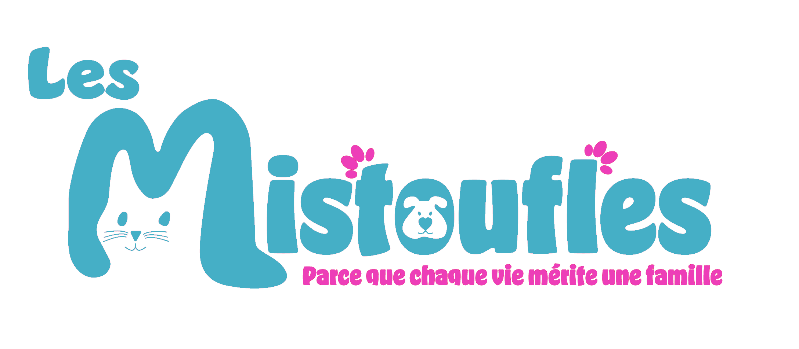

# 🐱 Mistoufles - Gestion de Refuge / Bénécole / Famille d'accueil

npm run dev → développement local (localhost)
npm run dev:staging → développement réseau local (192.168.1.12)
npm run build:staging → build pour environnement staging
npm run build → build pour production

  
  
  
  

## 📖 À propos

Mistoufles est une application web moderne dédiée à une gestion complète d'un refuge pour animaux. Notre solution simplifie le quotidien des associations de protection animale en offrant une interface intuitive et des outils performants.

## ✨ Points Forts

🏠 **Gestion Intuitive du Refuge**

- Tableau de bord centralisé
- Suivi en temps réel des pensionnaires
- Gestion optimisée des entrées/sorties
- Processus d'adoption simplifié

🐈 **Suivi des Chats**

- Fiches détaillées par chat
- Planning des soins
- Suivi comportemental
- Albums photos

👥 **Gestion des Bénévoles**

- Réseau des familles d'accueil
- Informations de contact

📊 **Analyse et Rapports**

- Statistiques détaillées
- Rapports personnalisables
- Indicateurs de performance

## 🛠️ Installation

### Prérequis

- Python 3.8+
- Node.js 14+
- PostgreSQL

### Démarrage rapide
